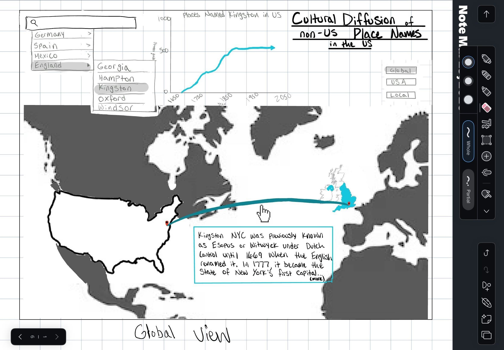
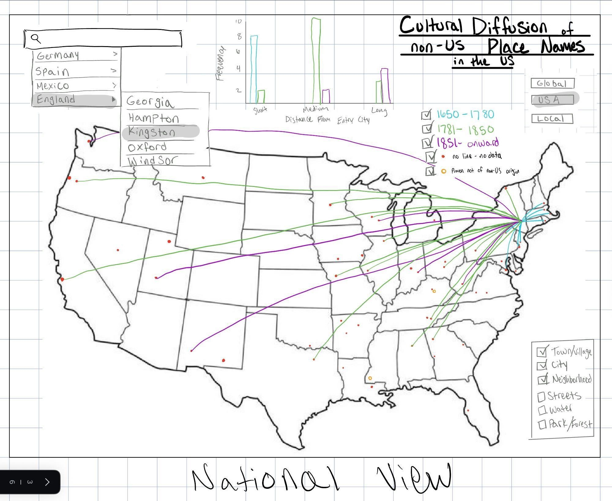
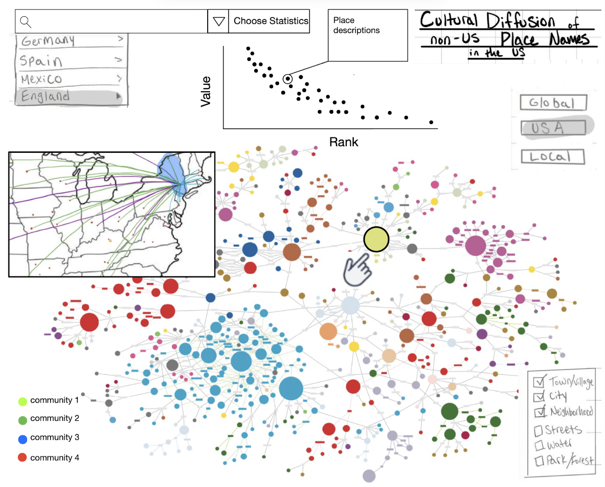

# Cultural Diffusion of Non-US Place Names in the US

### Molly Anderson & Ray Wang

### Final Proposal
# User Profile

This visualization is designed for users who are interested in 
understanding the cultural and historical processes embedded in geographic 
naming systems. The primary audience includes students in 
geography, GIS, and urban studies, as well as researchers exploring 
cultural diffusion, historical geography, and spatial semantics. These 
users are assumed to have basic map literacy and familiarity with 
interactive web maps. They are not expected to have prior knowledge of 
place-name etymology or cultural history.

In addition, the system also targets general users who are curious about 
why certain place names appear in specific regions of the United States 
and how these names reflect broader historical processes such as 
colonization, migration, and cultural influence. Therefore, the interface 
must support both exploratory analysis and intuitive understanding, 
allowing users to gradually move from high-level patterns to detailed 
interpretations.

For this proposal, we will use an example target user: Anne Humphry
Anne is an undergraduate student majoring in history and doing a final 
project for a class where she must compile and analyze cultural/historical 
evidence to argue that the first large wave of immigration to the US 
(1840-1889) was more impactful than the other waves as it fundamentally 
predefined American identity. She recently has been looking into settlement 
patterns and preserved cultural identity when she stumbled upon this 
interactive map and wonders if she can use it. Anne has limited expertise 
in GIS and geospatial tools, but she is familiar with Google Maps, which 
she uses almost daily. She is willing to spend a little time learning how 
to use an interface to get the insights she is looking to include in her 
project.

---

# Scenario

A user begins with a general curiosity about why many places in the United 
States share names with European locations or reflect non-local cultural 
origins. For example, the user may notice names such as “York,” “Athens,” 
or “San Antonio,” and wonder how these names emerged and spread across the 
U.S.

The user first interacts with a global-scale visualization that shows 
origin regions outside the United States and their cultural connections to 
U.S. place names. From this overview, the user gains an initial 
understanding of major source regions such as England, Spain, and Germany. 
The user then zooms into the United States to explore how these names are 
distributed spatially and how they diffuse from early settlement regions, 
particularly along the East Coast, toward inland areas.

Finally, the user investigates specific place names or clusters, examining 
their origins, similarities, and relationships to other names through both 
spatial proximity and semantic similarity. This process follows a 
progressive exploration workflow consistent with the Schneiderman's mantra 
of “overview first, zoom and filter, then details-on-demand”.

Since Anne is interested in those that came to the US during the first wave 
of immigration, she chooses to look into German names first, choosing "Berlin"
as her first subject. She is shocked to discover that the name initially came 
over with settlers much earlier than she would assume, with at least three 
places named Berlin before the year 1800! She uses the toggle to show her 
beyond the initial names,and finds, with the help of the coordinated bar 
chart,that diffusion of the name spiked durirng exactly the time she is 
studying, especially when she filters for just city and street names. She 
hovers over some of the points to learn percisely when they were denoted. She 
clicks on one of them to bring up the general information panel. She learns 
about how some of the places are called 'New' Berlin or how the mapmakers note 
there is more directionally defined Berlins than other names (North,East,
South,West). She clicks on the line chart to get the exact value of the peak 
for her notes, and then decides to choose a few other of the names given to
be representative evidence for her project arguement. 

---

# ️ Requirements

## Representation

The website represents cultural diffusion of place names through multiple 
coordinated views that operate across different spatial and conceptual 
scales. 

At the global level, the visualization presents origin regions 
outside the United States, highlighting areas such as Europe that have 
historically contributed to U.S. place naming. These regions are connected 
to the United States using directional links that represent inferred 
cultural diffusion pathways. These links do not indicate literal migration 
routes but rather symbolic or historical connections between naming 
origins and their adoption in the U.S.

At the national level, the United States is visualized as a spatial 
distribution of place names, where each location is represented as a 
connected point. These points are encoded by origin category, allowing users to 
distinguish between names derived from different cultural or linguistic 
backgrounds. Additional visual encodings may include temporal categories 
or clustering structures to reveal patterns of expansion and 
concentration.

Complementing the map views, statistical representations are included to 
summarize the distribution of place names by origin and distance. These 
views help users understand aggregate patterns, such as which cultural 
sources are most dominant and how far names tend to diffuse from their 
inferred origins.

Finally, a coordinated detail view links the non-spatial semantic network 
with the geographic map. The network represents relationships between place 
names in an abstract similarity space, while the map situates them in 
physical space. Selecting a node in the network highlights its geographic 
location and inferred diffusion links, allowing users to trace connections 
between semantic relationships and spatial distributions.

---

## Interaction

- Overview  

The webstie begins with a global overview that presents the major origin 
regions and their connections to the United States. This allows users to 
immediately grasp the large-scale structure of cultural diffusion and 
identify dominant source regions.

- Zoom and Filter  

Users can zoom into specific geographic regions within the United States 
and apply filters based on origin categories or place types. This enables 
focused exploration of spatial patterns, such as regional clustering or 
diffusion gradients from coastal to inland areas.

- Time Evolution  

The website introduces a temporal exploration mechanism that allows users 
to examine how place-name diffusion evolves over time. 
Because explicit temporal data are not always available, time is represented 
as an inferred or categorized dimension (e.g., early 
settlement period, westward expansion period, modern naming).

Users can interact with a timeline slider or discrete temporal categories to 
animate the diffusion process, observing how place names appear and spread 
across the United States. This allows users to interpret diffusion not only 
as a spatial pattern but as a dynamic historical process.

 - Details-on-Demand  

When users select individual locations, the webstie reveals detailed 
information about the place name, including its origin and interpretation. 
This allows users to connect abstract patterns to specific examples 
without cluttering the main visualization.

- Coordinated Interaction  

Interactions in one view are reflected across all other views. Selecting 
an origin category highlights corresponding locations on the map and 
updates statistical charts. Similarly, selecting a geographic region 
filters the dataset and synchronizes all visual components, enabling 
integrated exploration.

---

# Conceptual Model

This project conceptualizes place names as carriers of cultural and 
historical information that exist simultaneously in multiple spaces. In 
geographic space, place names are anchored to specific locations and can 
be analyzed in terms of spatial distribution and diffusion. In semantic 
space, place names encode linguistic and cultural meaning, which can be 
extracted and compared through computational methods such as embedding. In 
relational space, place names form networks based on similarity and shared 
origin.

The visualization integrates these perspectives by combining spatial 
mapping, semantic summaries, and network representations. Cultural 
diffusion is interpreted as a process that links these spaces, 
transforming geographic distributions into interpretable patterns of 
historical and semantic relationships.

---

#  Wireframe Mock-ups

## Wireframe 1 — Global Diffusion View

The first wireframe presents a global overview in which regions outside 
the United States are shown as sources of place names. Arrows connect 
these regions to the United States, representing inferred cultural 
diffusion. Annotations provide contextual explanations, such as historical 
transitions in naming.

---

## Wireframe 2 — U.S. Diffusion View

The second wireframe focuses on the United States and visualizes the 
spatial distribution of place names. Points represent locations, and their 
color encodes origin or time period. Lines extending from early settlement 
regions illustrate the directional spread of place names into inland 
areas.

---

## Wireframe 3 — Network View across Scale

The third wireframe introduces a network-based representation. Each node 
represents a place name, and edges represent similarity relationships 
between names. Node size encodes importance or frequency, while edge 
thickness represents correlation strength derived from embedding 
similarity.

This view reveals clusters of names that share linguistic or cultural 
characteristics, providing insights that are not visible in geographic 
space alone.

---

# Data Sources

- USGS GNIS  

The GNIS dataset provides official place names along with geographic 
coordinates and feature classifications. These data serve as the spatial 
backbone of the project, enabling mapping and spatial analysis of 
place-name distribution across the United States.

- StNamesLab (OpenStreetMap-derived street names)  

This dataset provides a large corpus of street names with associated 
geographic context. It serves as a linguistic resource for analyzing 
naming patterns and extracting textual features such as tokens and 
structural components.

- Token Embedding of Foundation Model (e.g., SBERT, Google Alpha Earth)  

Pre-trained geo-foundation models are used to transform place names into vector 
representations. These embeddings enable the computation of semantic 
similarity between names, which is used to construct the network 
visualization. Edge weights in the network represent correlation strength 
derived from embedding similarity.

- Other Data 

OSM street Network, Fousquare POIs, Building Footprint data, and Census data
will be used as basemap.
---

# ️ Limitations & Considerations

The diffusion paths represented in the visualization are conceptual rather 
than literal. They do not correspond to exact migration routes but instead 
reflect inferred cultural relationships. Therefore, the arrows should be 
interpreted as symbolic connections rather than physical trajectories.

Identical or similar place names do not always indicate direct historical 
inheritance. Some names are adopted symbolically or independently, and 
embedding-based similarity captures linguistic resemblance rather than 
full cultural or historical meaning. These factors should be considered 
when interpreting the results.

---
# Expected Outcome

The website will reveal how place names function as indicators of 
cultural diffusion and historical processes. By integrating spatial 
visualization, statistical summaries, and network analysis, the website 
enables users to explore place names across multiple dimensions and 
demonstrates how geographic data can be extended into semantic and relational domains, transforming simple location-based 
information into a richer understanding of cultural patterns and 
historical connections.

